# Sephiria Personal Convenience

Sephiria 1.0.33 / BepInEx 5용 개인 편의 기능 통합 모드.

## 게임 내 사용

**옵션 → 확장** 탭에서 각 기능을 켜고 끕니다. 기본값은 모두 켜기이며 변경 즉시 저장됩니다.

- **이번 방 재시도 버튼**: 던전의 일시정지 메뉴에서 `포기` 위에 `이번 방 재시도`를 표시합니다. 옵션을 변경한 후 이미 열려 있던 일시정지 메뉴에도 즉시 반영합니다. 마지막 방 시작 체크포인트로 복구하며, 타이틀로 나가는 과정을 생략합니다.
- **주사위 결과 미리보기**: 레벨업·보스·미니보스·일반 아티팩트 및 석판 보상의 다음 리롤 1회 결과를 현재 선택지 뒤에 표시합니다. 기적 선택은 화면 아래쪽, 무기 강화는 화면 오른쪽에서 다음 후보를 미리 보여줍니다. 리롤하면 다음 결과로 갱신됩니다. 미리보기만으로 주사위나 무료 리롤을 소비하지 않습니다.
- **과일 꼬치 콤보 강조**: 과일 꼬치에서 출현 확률을 늘린 콤보에 속한 아이템을 민트색 테두리로 표시합니다. 상점, 레벨업 및 일반/보스 아티팩트 보상 선택지, 주사위 미리보기에 적용합니다. 감소시킨 콤보는 강조하지 않습니다. 던전에서는 현재 저장 설정이 아닌 이번 던전 입장 시 실제 적용된 꼬치를 기준으로 합니다.
- **공격 피해·DPS 상세보기**: 무기·아티팩트·콤보 효과를 선택해 타격별 피해, 속성·고정 추가 피해, 풀 버프 피해와 지속 DPS를 확인합니다.
- **보상 DPS 증가율**: 아티팩트 보상 선택지에 현재 주 장비 기준 레벨 0·최대 레벨의 예상 DPS 증가율을 표시하고 가장 높은 후보를 추천 아이콘으로 표시합니다.

재시도는 싱글플레이 전용이며 보상·기적 미리보기는 싱글플레이/호스트에서만 표시합니다. 무기 강화는 로컬 시드로 계산합니다. 게스트에는 보상 시드가 동기화되지 않으므로 미리보기를 표시하지 않습니다. 멀티플레이는 실제 세션으로 검증하지 않았습니다.

## 기능 화면

### 설정

`옵션 → 확장`에서 각 기능을 켜거나 끄고 업데이트를 확인합니다.

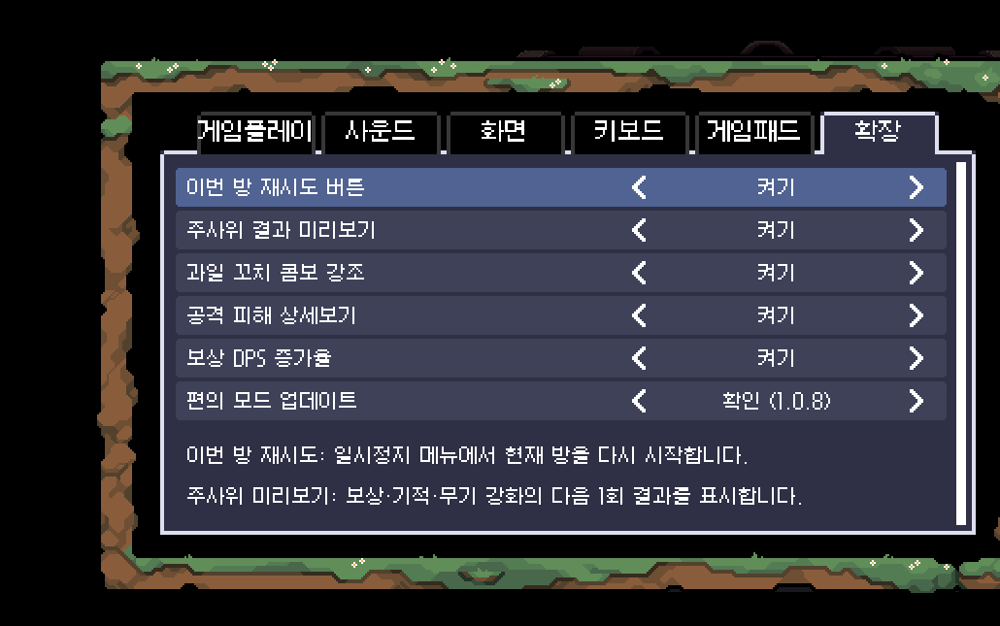

### 이번 방 재시도

일시정지 메뉴에서 현재 방의 진입 상태로 바로 돌아갑니다.

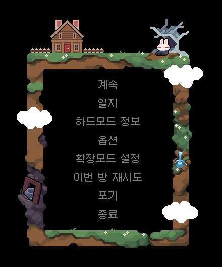

### 사망 시 유료 재시도

결과 정산 전에 사파이어를 사용해 사망한 방을 다시 시작합니다. 비용은 모험 내 재시도 횟수에 따라 2, 4, 8, 16, 32개까지 증가합니다.

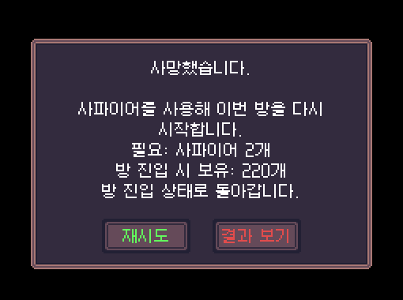

### 보상 리롤 미리보기와 DPS 증가율

다음 리롤 결과를 현재 선택지 뒤에 미리 표시합니다. 아티팩트 선택지에는 현재 주 장비 기준 DPS 증가율과 가장 높은 후보의 추천 아이콘도 함께 표시합니다.

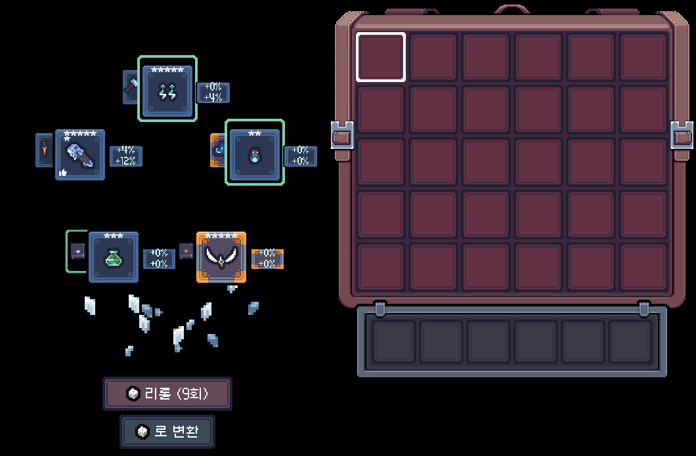

마법서는 책 모양 안에 실제 마법 아이콘을 표시해 어떤 마법인지 구분할 수 있습니다.

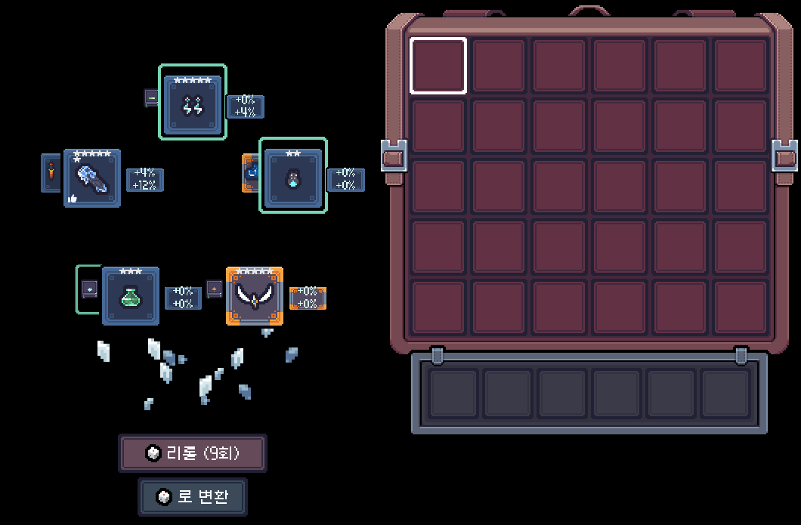

### 과일 꼬치 콤보 강조

현재 모험에서 출현 확률을 높인 콤보의 아이템을 상점과 보상 선택지에서 민트색 테두리로 표시합니다.

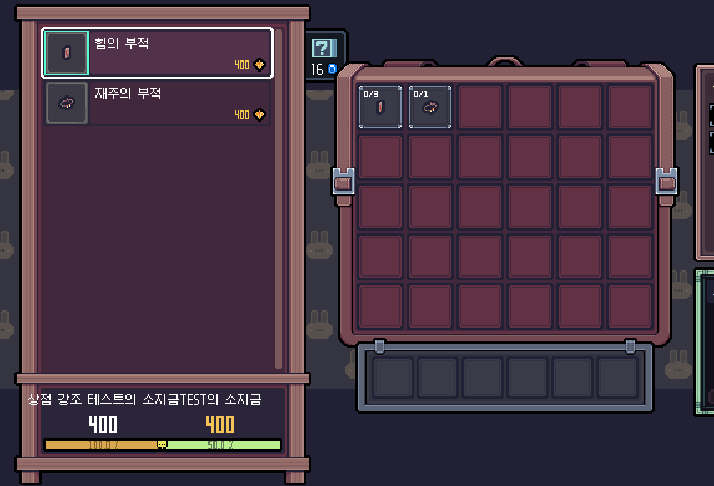

### 공격 피해 상세보기

무기·아티팩트·콤보 효과의 타격별 일반 피해와 치명타 피해, 속성 및 고정 추가 피해를 계산해 보여줍니다.

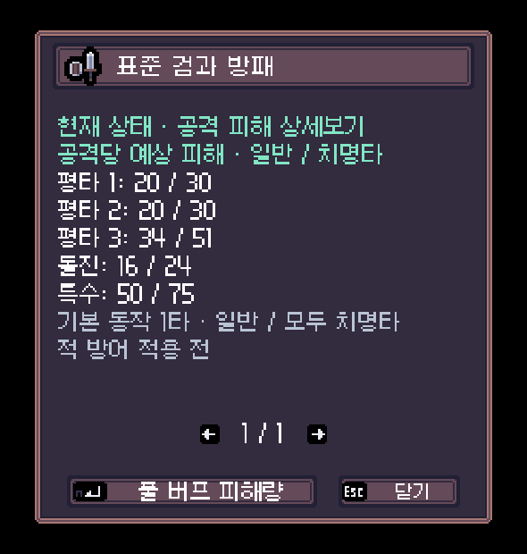

### 예상 DPS

평타·돌진·특수공격을 구분하고 공격 속도, 재사용 대기시간, 치명타 기대값과 추가 피해를 반영한 지속 DPS를 별도 화면에서 표시합니다.

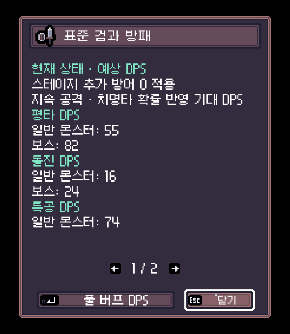

### 콤보 효과 상세보기

콤보 효과를 선택하면 전용 피해와 디버프 피해를 확인할 수 있으며 결속 아티팩트의 속성 변경도 반영합니다.

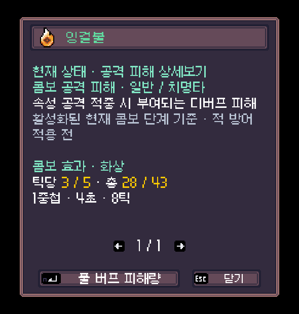

### 모루 리롤 미리보기

다음 강화 후보를 원본 선택지와 같은 프레임·아이콘·이름으로 오른쪽에 미리 보여줍니다. 재능으로 선택지가 늘어나면 미리보기 수도 함께 늘어납니다.

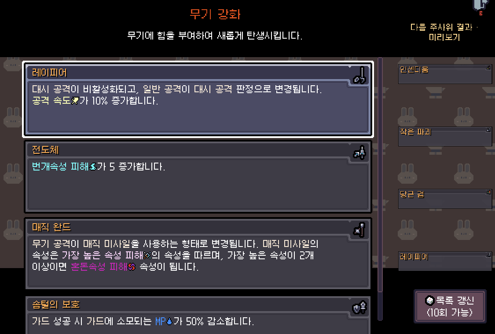

### 인게임 업데이트

새 버전이 있으면 게임 안에서 내려받고, 다음 실행 때 검증된 DLL로 교체합니다.

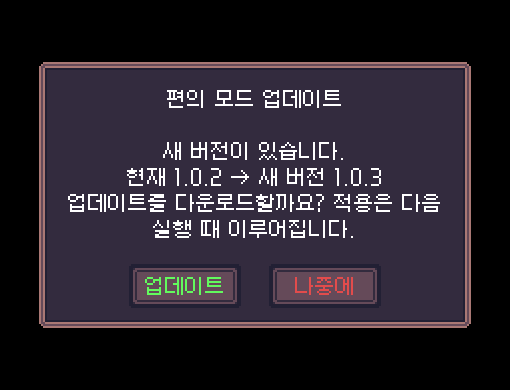

## 설치

`dist/SephiriaPersonalConvenience.dll`을 `BepInEx/plugins`에 설치합니다. 중복 실행을 막기 위해 별도 `SephiriaRoomRetry.dll` 또는 `SephiriaDicePreview.dll`은 plugins 밖으로 옮깁니다. 기존 자동 조준, 프리셋 및 확장모드는 통합 대상이 아닙니다.

설정: `BepInEx/config/local.sephiria.personal-convenience.cfg`

설치한 뒤 게임을 한 번 재시작해야 로드됩니다. 이후 옵션 변경에는 재시작이 필요 없습니다.

## 구현 및 검증

- 보상 오브젝트의 비활성 복제본, 독립된 반복 제외 큐 및 발급 ID 집합으로 네이티브 보상 생성 함수를 호출합니다. 원본 보상/시드/주사위/무료 횟수/발급 ID가 보존되는지 검사합니다.
- 테두리는 클릭을 받지 않는 별도 UI 이미지입니다. 원래 아이템 선택, 가격, 등급 표시를 유지합니다.
- 확장 탭은 네이티브 탭/옵션 행을 사용하며 원래 탭을 유지합니다.
- `build.ps1`, `run-smoke.ps1`, `run-retry-smoke.ps1`, `run-other-smoke.ps1` 사용. 테스트 런타임은 사용자 게임 및 저장 파일과 분리되어 있습니다.
- `evidence/`에 통합 테스트 로그, UI 렌더, 설치 해시를 보관합니다. UI 이미지는 1280×800에서 실제 Canvas를 별도 렌더한 것으로 배경 월드는 포함하지 않습니다.


## 1.0.1 — 모든 주사위 리롤 화면

- 레벨업 전용 표시 조건을 제거했습니다. 일반·대형·보스·아티팩트·석판·보스 석판 보상 모두 다음 1회 결과를 표시합니다.
- 기적 선택은 다음 리롤 횟수와 최근 제시 목록을 독립된 복제본에 적용해 계산합니다.
- 무기 강화는 다음 시드와 남은 후보 목록의 복제본으로 계산합니다.
- 세 종류의 리롤 화면은 동일한 `확장 → 주사위 결과 미리보기` 토글을 사용합니다.
- 게임 1.0.33의 주사위 차감 호출 경로를 확인했습니다. 무작위 선택을 바꾸는 사용처는 보상, 기적, 무기 강화입니다. 패시브/최대 주사위 수 변경은 리롤 콘텐츠가 아닙니다.
- 격리 테스트: 보상 6종 각각 5회 결과/원본 불변 검사 및 네이티브 UI 리롤, 기적 4회와 무기 강화 4회 결과/원본 불변/표시/토글 검사. 화면 렌더로 보스·미니보스 계열 보상, 기적·강화 미리보기를 확인했습니다. 보스 처치 자체를 재현한 테스트가 아니라 실제 보상 타입과 UI를 여는 테스트입니다.


## 1.0.2 — 사망 후 현재 스테이지 재시도 (과거 동작, 1.0.5에서 변경)

- 싱글플레이 사망 화면 하단에 `현재 스테이지 재시도` 버튼을 추가합니다. 현재 스테이지의 **첫 방 진입 저장**으로 돌아갑니다.
- 체력·마나·장비·소지 재화와 진행 상태를 입장 시점으로 되돌립니다. 사망 정산으로 받은 사파이어 및 사망 화면에서 변경한 프로필 상태도 되돌리므로 반복 정산 보상을 유지하지 않습니다.
- 타이틀이나 새 네트워크 세션으로 이동하지 않고 기존 방 재시도와 같은 네이티브 재생성/이어하기 경로를 사용합니다. 일시정지 메뉴의 `이번 방 재시도`는 기존 동작을 유지합니다.
- 최초 스테이지 진입 저장 완료 시 저장 폴더에 `<슬롯>.stage-retry` 파일을 별도로 보관합니다. 슬롯·런 시드·스테이지·첫 방 ID가 일치하는 기록만 사용합니다. 같은 스테이지 재방문이나 방 재시도로 시작 기록을 덮어쓰지 않습니다.
- 설치 전에 이미 진행 중이던 스테이지의 시작 상태는 복구할 수 없습니다. 새 스테이지 진입 이후부터 사용할 수 있습니다. 시작 기록이 없거나 손상되면 사망 화면을 유지하고 안내합니다.
- 클리어 화면 및 멀티플레이에는 표시하지 않습니다. 게임의 최초 사망 스토리 자동 이동은 유지합니다.
- 테스트: `run-stage-smoke.ps1`. 격리 런타임에서 실제 사망, 다른 방에서 첫 방 복원, 두 스테이지 반복 재시도, 기존 방 재시도와 UI를 검증합니다.


## 1.0.3 — 공개 저장소 및 인게임 업데이트

저장소: https://github.com/m6023m/SephiriaPersonalConvenience

게임 시작 시 공개 GitHub 최신 정식 버전을 확인합니다. 새 버전이 있으면 게임 기본 UI로 현재/최신 버전과 `업데이트 / 나중에`를 표시합니다. **옵션 → 확장 → 편의 모드 업데이트**에서도 직접 확인할 수 있습니다. 같은 버전이면 그대로 사용하며, 개발 중인 더 높은 버전을 과거 릴리스로 내리지는 않습니다.

`업데이트`를 누르면 DLL을 다운로드하고 크기·SHA256·어셈블리 이름/버전을 검증합니다. 게임을 다시 실행하면 BepInEx 적용기가 플러그인 로드 전에 교체하고 이전 DLL을 백업합니다. 다운로드 중에는 현재 버전으로 계속 플레이할 수 있습니다. 연결 실패나 검증 실패 시 현재 버전을 유지합니다. GitHub 로그인이나 토큰은 필요 없습니다.

최초 설치 파일:
- `SephiriaPersonalConvenience.dll` → `BepInEx/plugins`
- `SephiriaPersonalConvenience.Updater.dll` → `BepInEx/patchers`

또는 게임을 종료한 뒤 릴리스의 `update.ps1`을 실행하면 두 파일을 검증해 설치합니다.

```powershell
pwsh -File .\update.ps1 -CheckOnly
pwsh -File .\update.ps1
pwsh -File .\update.ps1 -GameDir 'D:\SteamLibrary\steamapps\common\Sephiria' -Version v1.0.3
```

시작 시 확인을 끄려면 `local.sephiria.personal-convenience.cfg`의 `[Updates] CheckOnStartup = false`를 사용합니다. 게임 안에서 수동 확인은 계속 사용할 수 있습니다.

설정·세이브는 업데이트하지 않습니다. 적용기 프로토콜이 바뀌는 버전은 두 파일을 수동/스크립트로 다시 설치해야 합니다. 게임 원본 DLL, 개인 저장 파일, 인증 정보, 테스트 런타임은 저장소에 포함하지 않습니다. 테스트용 `*Smoke.cs`는 게임 설치 대상이 아니며 별도의 격리 CombatTestArena 환경이 필요합니다.


## 1.0.4 — 사망 정산 전에 재시도 선택 (복원 대상은 1.0.5에서 변경)

사망 직후 결과 화면이 뜨기 **전**에 `재시도 / 결과 보기`를 선택합니다. 재시도는 현재 스테이지의 첫 방 진입 상태로 복원하며, 선택 대기 중에는 게임을 일시정지합니다. 재시도 시 사망 정산·진행 저장 삭제·최초 사망 자동 이동을 실행하지 않습니다. `결과 보기`를 고르면 원래 게임의 사망 처리가 한 번 실행됩니다.

이전 결과 화면의 재시도 버튼은 이 선택창으로 대체했습니다. 일시정지 메뉴의 `이번 방 재시도`는 살아 있을 때 사용하며 기존 동작을 유지합니다. 유효한 시작 기록이 없으면 재시도를 거부하고 선택창을 유지합니다. 시작 기록이 없는 상태를 새 게임으로 처리하지 않습니다.


## 1.0.5 — 사망한 이번 방 재시도

사망 직후 `재시도 / 결과 보기` 선택창에서 재시도를 누르면 **지금 사망한 방에 들어왔을 때의 상태**로 돌아갑니다. 일시정지 메뉴의 `이번 방 재시도`와 같은 방 진입 저장 및 복원 경로를 사용합니다. 이전 방까지 얻은 장비·재화 등은 방 진입 저장에 포함된 상태로 유지하며, 이번 방에서의 변화는 되돌립니다.

스테이지 첫 방으로 복원하던 기능은 제거했습니다. 별도 `.stage-retry` 기록은 더 이상 만들거나 읽지 않으며, 기존 파일은 그대로 두어도 됩니다. 사망 정산 전 선택·중복 클릭 방지·결과 보기의 원래 사망 처리는 유지합니다. 현재 방 저장이 없거나 손상되면 재시도를 거부하고 선택창을 유지합니다. 싱글플레이 전용입니다.


## 1.0.6 — 사망 후 이번 방 재시도 비용

사망 선택창의 `재시도`는 사파이어를 사용합니다. 한 모험에서 순서대로 **2 → 4 → 8 → 16 → 32개**, 이후에는 계속 **32개**입니다. 새 모험을 시작하면 다시 2개부터 적용합니다.

선택창에 필요한 수량과 **방 진입 저장 기준 사용 가능한 사파이어**를 표시합니다. 기존 보유량과 그때까지 모험에서 획득한 수량을 합하고, 이미 사용한 수량을 뺍니다. 지금 죽은 방에서 새로 얻은 사파이어는 재시도 비용에 사용할 수 없습니다. 부족하거나 저장을 확인할 수 없으면 재시도를 거부하며 `결과 보기`는 계속 사용할 수 있습니다.

재시도 비용과 다음 비용 단계는 방 진입 저장에 함께 기록됩니다. 방을 다시 불러오거나 이어하기를 해도 차감이 취소되지 않습니다. 일시정지 메뉴의 일반 `이번 방 재시도`는 기존처럼 무료이며 사망 재시도의 비용 단계도 유지합니다. 사파이어 사용량은 게임의 기존 정산 방식으로 처리합니다.


# v1.0.7 — 장비 피해 상세보기와 UI 정리

- 무기·아티팩트 툴팁의 상세보기에서 공격별 예상 일반/치명타 피해를 확인합니다. 옵션 → 확장에서 켜고 끌 수 있습니다.
- 사용 가능한 버프 마법·무기 버프를 반영하는 풀 버프 피해량 보기를 제공합니다. 타격별 수치는 일반 몬스터 기준이며 보스·미니보스 전용 행은 표시하지 않습니다.
- 피해 표시는 소수점 이하를 내립니다. 내부 계산은 소수점을 유지합니다. 자원·발동 조건이 있는 장비는 해당 조건과 범위를 함께 표시합니다.
- 상세보기/풀 버프/닫기/페이지 이동을 게임 기본 단축키 아이콘으로 표시하고, 키보드·게임패드 전환에 맞춰 갱신합니다. 버튼이 창 밖으로 나가던 배치를 수정했습니다.
- 필요한 게임 데이터를 수집한 뒤 수치 계산은 작업 스레드에서 수행합니다. 이전 결과가 있으면 유지하면서 계산 중 표시를 보여줍니다.
- DPS는 이번 버전에 포함하지 않았습니다. 수치는 적 고유 방어·내성 적용 전 예상 피해이며 실제 모든 전투 상황의 확정 피해를 뜻하지 않습니다.

인게임 업데이트는 다운로드 후 다음 게임 실행 시 적용됩니다. 전투시뮬레이션은 배포하지 않습니다. 과거 시험장 모듈을 별도로 설치했다면 게임 종료 후 `remove-combat-test-arena.ps1`을 실행하면 캐릭터별 게임 시작 아래의 시험장 버튼을 만드는 두 모듈을 백업하고 제거합니다.


# v1.0.8 — 공격별 DPS와 추가 피해 상세

- 무기와 공격형 아티팩트 상세보기에서 평타·돌진·특수공격의 지속 공격 기준 예상 DPS를 별도 화면으로 확인합니다. 재장전·재사용 대기시간, 치명타 기대값과 확률 효과를 반영합니다.
- 기본 피해에 타격마다 붙는 고정·속성 추가 피해의 계산식과 합계를 함께 표시합니다. 고정 피해는 회색, 속성 피해는 스탯 화면 색, 합계는 피해 비율을 섞은 색으로 표시합니다.
- 콤보 효과를 선택하면 전용 피해와 디버프 상세를 확인할 수 있으며 결속 아티팩트의 속성 변경도 반영합니다.
- 재조립 특수공격, 풀 버프에서 달라지는 평타 콤보, 단검 패리 후 퓨리처럼 무기 상태에 따라 달라지는 공격 구성을 구분합니다.
- 여러 아티팩트 장착 시 상세 선택이 엇갈리던 문제와 불필요한 재계산 표시로 패널 크기가 흔들리던 문제를 수정했습니다.
- 선택 장비 프레임, 입력 장치별 기본 단축키 아이콘, 치명타 100% 이상에서 중복 일반 피해 숨김을 적용했습니다.

전투시뮬레이션은 배포하지 않습니다. 아직 전용 지속시간 모델이 필요한 특수 아티팩트는 `ARTIFACT_DPS_AUDIT.md`에 정리되어 있습니다.


# v1.0.9 — 보상 DPS 예측과 리롤 미리보기 UI

- 레벨업·미니보스·보스·아티팩트 선택지에 현재 장비 중 DPS가 가장 높은 장비를 기준으로 후보 아티팩트의 레벨 0·최대 레벨 DPS 증가율을 표시합니다.
- 후보 장비로 활성화되는 콤보 효과까지 다시 계산하고 증가율이 가장 높은 선택지의 왼쪽 아래에 추천 아이콘을 표시합니다.
- 다음 리롤 아이템을 원본 선택지 뒤에 겹쳐 표시하고, 마법서는 책 안에 실제 마법 아이콘을 표시합니다.
- 모루의 다음 강화 후보를 게임 선택지 프레임·아이콘·이름으로 오른쪽에 표시합니다. 추가 선택지 재능으로 후보가 4개가 되어도 같은 수만큼 세로로 배치합니다.
- 장비별 전용 공격, 조건부 효과, 추가 피해와 풀 버프 상태의 공통 계산 경로를 보강하고 변경된 계산만 다시 검증할 수 있도록 테스트 도구를 갱신했습니다.
- 추천 아이콘은 Font Awesome의 CC BY 4.0 아이콘을 사용하며 라이선스 원문을 `Assets/FONT-AWESOME-LICENSE.txt`에 포함합니다.
